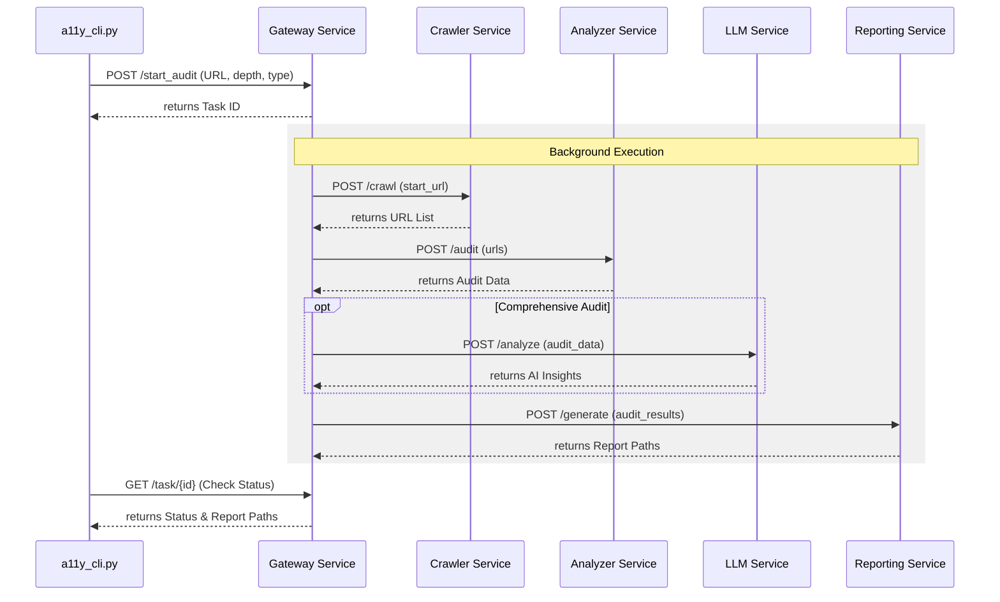

# A11ySense AI: Microservices Architecture

A11ySense AI is designed as a decentralized, microservices-based architecture to ensure independence, scalability, and ease of maintenance. Each component performs a specific role and communicates via REST APIs (FastAPI).

## Architecture Overview

The system consists of five primary independent services orchestrated by a central **Gateway**.

### 🏗️ Service Components

1.  **Gateway Service (Port 8000)**:
    - Acts as the central entry point for all client requests.
    - Orchestrates the asynchronous workflow between other services.
    - Manages task IDs and provides status updates.
    - **Logic**: `src/services/gateway.py`

2.  **Crawler Service (Port 8001)**:
    - Handles automated URL discovery using **Playwright**.
    - Supports configurable depth and anti-blocking (stealth mode).
    - **Logic**: `src/services/crawler.py` (Wraps `src/crawler`)

3.  **Analyzer Service (Port 8002)**:
    - Executes accessibility audits using the **axe-core** engine.
    - Supports Basic and Comprehensive audit types.
    - **Logic**: `src/services/analyzer.py` (Wraps `src/analyzer`)

4.  **LLM Service (Port 8003)**:
    - Provides AI-powered accessibility insights using **Groq (Llama 3)**.
    - Analyzes audit results for business impact, ROI, and code fixes.
    - **Logic**: `src/services/llm.py` (Wraps `src/llm`)

5.  **Reporting Service (Port 8004)**:
    - Processes raw audit data into professional reports.
    - Generates **Excel** and **JSON** formatted outputs.
    - **Logic**: `src/services/reporting.py` (Wraps `src/reporting`)

## Service Communication Flow

The interaction between services follows a linear orchestration flow managed by the Gateway:

## Process Orchestration
Independent services are managed without Docker using the `manager.py` utility, which handles background process life-cycles (start/stop/status) and logging.

## Data Flow & Storage
- **Logs**: Each service directs its output to `storage/logs/`.
- **Reports**: Final outputs are stored in `storage/reports/`.
- **Config**: Shared configuration is managed via `config/config.yaml`.
